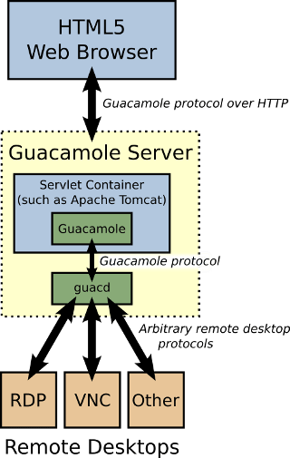
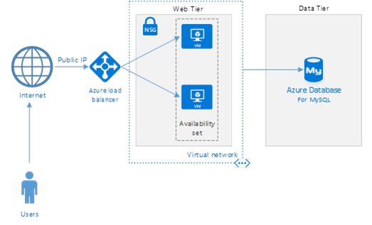
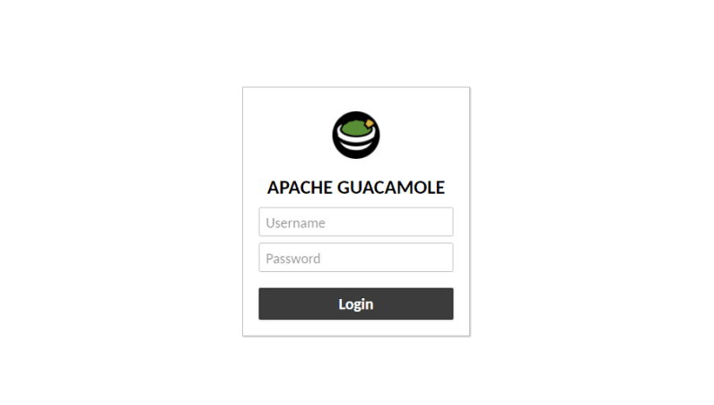
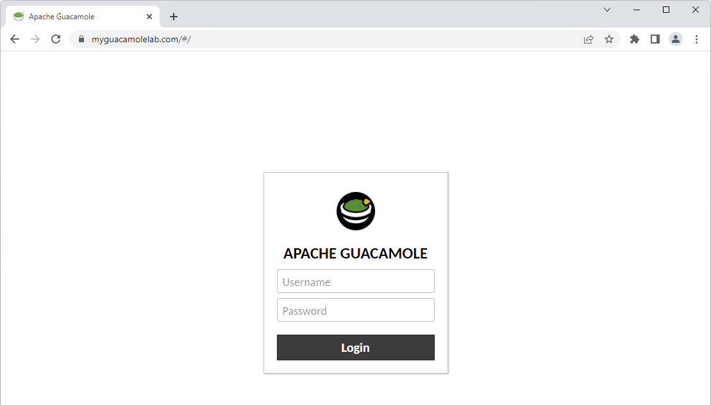

# Deploying Apache Guacamole on Azure

In this post I'll show you how to create your own jump server using [Apache Guacamole](https://guacamole.apache.org/), an open source tool wich provide similar funcionalities from [Azure Bastion](https://docs.microsoft.com/en-us/azure/bastion/bastion-overview).

## Apache Guacamole

Apache Guacamole is a clientless remote desktop gateway that supports standard protocols like VNC, RDP, and SSH. Clientless means your clients don't need to install anything but just use a web browser to remotely access your fleet of VMs.

The Guacamole comprises of two main components:

* Guacamole Server which provides guacd which is like a proxy server for the client to connect to the remote server.
* Guacamole Client which is a servelet container that user will log in and via web browser.



For more information about Guacamole, visit its [architecture page](https://guacamole.apache.org/doc/gug/guacamole-architecture.html).

## Apache Guacamole on Azure Architecture

The drawing below refers to the suggested architecture. This architecture includes a public load balancer that receives external accesses and directs them to two virtual machines in the web layer. The web layer communicates with the data layer where we have a MySQL database responsible for store login information, accesses and connections.



The Availability Set guarantees a 99.95% SLA for virtual machines and using Azure Database for MySQL, a highly available, scalable, managed database as a service guarantees a 99.99% SLA.

## Prerequisites

* I recommend use the Bash environment in [Azure Cloud Shell](https://docs.microsoft.com/en-us/azure/cloud-shell/quickstart). If you prefer run on your own Windows, Linux or MacOs, [install](https://docs.microsoft.com/en-us/cli/azure/install-azure-cli) the Azure CLI to run referenced commands.

[](http://shell.azure.com/)


## Setup

### Declaring variables

```
# Variables
rg=rg-guacamole
location=eastus
mysqldb=guacamoledb
mysqladmin=guacadbadminuser
mysqlpassword=MyStrongPassW0rd
vnet=myVnet
snet=mySubnet
avset=guacamoleAvSet
vmadmin=guacauser
nsg=NSG-Guacamole
lbguacamolepip=lbguacamolepip
pipdnsname=loadbalancerguacamole
lbname=lbguacamole
```

### Resource  group creation
```
az group create --name $rg --location $location
```

### MySQL Creation
```
az mysql server create \
--resource-group $rg \
--name $mysqldb \
--location $location \
--admin-user $mysqladmin \
--admin-password $mysqlpassword \
--sku-name B_Gen5_1 \
--storage-size 51200 \
--ssl-enforcement Disabled
```

### MySQL Firewall Settings

```
az mysql server firewall-rule create \
--resource-group $rg \
--server $mysqldb \
--name AllowYourIP \
--start-ip-address 0.0.0.0 \
--end-ip-address 255.255.255.255
```

### VNET creation
```
az network vnet create \
--resource-group $rg \
--name $vnet \
--address-prefix 10.0.0.0/16 -\
-subnet-name $snet \
--subnet-prefix 10.0.1.0/24
```

### Availability set creation
```
az vm availability-set create \
--resource-group $rg \
--name $avset \
--platform-fault-domain-count 2 \
--platform-update-domain-count 3
```

### VMs Creation
```
for i in `seq 1 2`; do
az vm create --resource-group $rg \
--name Guacamole-VM$i \
--availability-set $avset \
--size Standard_DS1_v2 \
--image Canonical:UbuntuServer:18.04-LTS:latest \
--admin-username $vmadmin \
--generate-ssh-keys \
--public-ip-address "" \
--no-wait \
--vnet-name $vnet \
--subnet $snet \
--nsg $nsg 
done
```
After executing these commands, two virtual machines will be created inside the Availability Set.

It is important to note that the SSH keys will be stored in the ~/.ssh directory of the host where the commands were executed (Azure Cloud Shell in this case). As the VM's are being created without a public ip address, we will be creating INAT rules a few steps ahead to be able to connect at the VM's through the Azure Load Balancer.

### Setting NSG rules
```
az network nsg rule create \
--resource-group $rg \
--nsg-name $nsg \
--name web-rule \
--access Allow \
--protocol Tcp \
--direction Inbound \
--priority 200 \
--source-address-prefix Internet \
--source-port-range "*" \
--destination-address-prefix "*" \
--destination-port-range 80
```

### Generating the Guacamole setup script locally on the VMs
```
for i in `seq 1 2`; do
az vm run-command invoke -g $rg -n Guacamole-VM$i  \
--command-id RunShellScript \
--scripts "wget https://raw.githubusercontent.com/ricmmartins/apache-guacamole-azure/main/guac-install.sh -O /tmp/guac-install.sh" 
done
```

### Adjusting database credentials to match the variables 
```
for i in `seq 1 2`; do
az vm run-command invoke -g $rg -n Guacamole-VM$i  \
--command-id RunShellScript \
--scripts "sudo sed -i.bkp -e 's/mysqlpassword/$mysqlpassword/g' \
-e 's/mysqldb/$mysqldb/g' \
-e 's/mysqladmin/$mysqladmin/g' /tmp/guac-install.sh"
done
```

### Executing the Guacamole setup script
```
for i in `seq 1 2`; do
az vm run-command invoke -g $rg -n Guacamole-VM$i \
--command-id RunShellScript \
--scripts "/bin/bash /tmp/guac-install.sh"
done
```

### Installing Nginx to be used as Proxy for Tomcat
```
for i in `seq 1 2`; do
az vm run-command invoke -g $rg -n Guacamole-VM$i \
--command-id RunShellScript --scripts "sudo apt install --yes nginx-core"
done
```

### Configuring NGINX
```
for i in `seq 1 2`; do
az vm run-command invoke -g $rg -n Guacamole-VM$i \
--command-id RunShellScript \
--scripts "cat <<'EOT' > /etc/nginx/sites-enabled/default
# Nginx Config
    server {
        listen 80;
        server_name _;

        location / {


                proxy_pass http://localhost:8080/;
                proxy_buffering off;
                proxy_http_version 1.1;
                proxy_set_header X-Forwarded-For \$proxy_add_x_forwarded_for;
                proxy_set_header Upgrade \$http_upgrade;
                proxy_set_header Connection \$http_connection;
                access_log off;
        }
}
EOT"
done
```

### Restart NGINX
```
for i in `seq 1 2`; do
az vm run-command invoke -g $rg -n Guacamole-VM$i \
--command-id RunShellScript \
--scripts "sudo systemctl restart nginx"
done
```

### Restart Tomcat
```
for i in `seq 1 2`; do
az vm run-command invoke -g $rg -n Guacamole-VM$i \
--command-id RunShellScript \
--scripts "sudo systemctl restart tomcat8"
done
```

### Change to call guacamole directly at "/" instead of "/guacamole" 
```
for i in `seq 1 2`; do
az vm run-command invoke -g $rg -n Guacamole-VM$i \
--command-id RunShellScript \
--scripts "sudo /bin/rm -rf /var/lib/tomcat7/webapps/ROOT/* && sudo /bin/cp -pr /var/lib/tomcat8/webapps/guacamole/* /var/lib/tomcat8/webapps/ROOT/"
done
```

### Creation of Public IP for the Azure Load Balancer
```
az network public-ip create -g $rg -n $lbguacamolepip -l $location \
--dns-name $pipdnsname \
--allocation-method static \
--idle-timeout 4 \
--sku Standard
```

### Creation of Azure Load Balancer
```
az network lb create -g $rg \
--name $lbname -l $location \
--public-ip-address $lbguacamolepip \
--backend-pool-name backendpool  \
--frontend-ip-name lbguacafrontend \
--sku Standard
```

### Creation of the healthprobe
```
az network lb probe create \
--resource-group $rg \
--lb-name $lbname \
--name healthprobe \
--protocol "http" \
--port 80 \
--path / \
--interval 15 
```

### Creation of the load balancing rule
```
az network lb rule create \
--resource-group $rg \
--lb-name $lbname \
--name lbrule \
--protocol tcp \
--frontend-port 80 \
--backend-port 80 \
--frontend-ip-name lbguacafrontend \
--backend-pool-name backendpool \
--probe-name healthprobe \
--load-distribution SourceIPProtocol
```

### Adding the VMs to the Load Balancer
#### Adding the VM1 to the Load Balancer
```
az network nic ip-config update \
--name ipconfigGuacamole-VM1 \
--nic-name Guacamole-VM1VMNic \
--resource-group $rg \
--lb-address-pools backendpool \
--lb-name $lbname 
```
#### Adding the VM2 to the Load Balancer
```
az network nic ip-config update \
--name ipconfigGuacamole-VM2 \
--nic-name Guacamole-VM2VMNic \
--resource-group $rg \
--lb-address-pools backendpool \
--lb-name $lbname 
```
### Creating the INAT rules

The INAT rules will allow connections made directly to the load balancer's address to be routed to servers under it according to the chosen port.

In this case, when making the connection on port 21 of the balancer, it will be directed to VM1 on port 22 (SSH) and the connection on port 23 of the balancer will be directed to VM2 on port 22 (SSH).

```
az network lb inbound-nat-rule create \
--resource-group $rg \
--lb-name $lbname \
--name ssh1 \
--protocol tcp \
--frontend-port 21 \
--backend-port 22 \
--frontend-ip-name lbguacafrontend
```

```
az network lb inbound-nat-rule create \
--resource-group $rg \
--lb-name $lbname \
--name ssh2 \
--protocol tcp \
--frontend-port 23 \
--backend-port 22 \
--frontend-ip-name lbguacafrontend
```

```
az network nic ip-config inbound-nat-rule add \
--inbound-nat-rule ssh1 \
--ip-config-name ipconfigGuacamole-VM1 \
--nic-name Guacamole-VM1VMNic \
--resource-group $rg \
--lb-name $lbname 
```

```
az network nic ip-config inbound-nat-rule add \
--inbound-nat-rule ssh2 \
--ip-config-name ipconfigGuacamole-VM2 \
--nic-name Guacamole-VM2VMNic \
--resource-group $rg \
--lb-name $lbname
```

If you want to connect to the VMs, see below how proceed:

```
ssh -i .ssh/id_rsa guacauser@<loadbalancer-public-ip> -p 21 (To access VM1)
ssh -i .ssh/id_rsa guacauser@<loadbalancer-public-ip> -p 23 (To access VM2)
```

## Testing

You try to access the client at ```http://<loadbalancer-public-ip>``` or ```http://<loadbalancer-public-ip-dns-name>``` and you should see the Guacamole's login screen and use the default user and password (guacadmin/guacadmin) to login: 
    

    
## Adding SSL
    
Maybe you want consider the usage of an SSL to be more compliant with security requirements. To add SSL we will use [Certbot](https://certbot.eff.org/) to get a certificate from [Let's Encrypt](https://letsencrypt.org/). Here are the steps you need to follow:

1. Ensure you have a valid domain with an A record pointing to the Azure Load Balancer Public IP. A valid domain with and A register defined is a pre-requisite for Certbot. 

2. After address the steps from 1, you must adjust your Nginx config file ```/etc/nginx/sites-enabled/default``` on both servers, setting the **server_name** directive to point to the name of your domain:
    
```
for i in `seq 1 2`; do
az vm run-command invoke -g $rg -n Guacamole-VM$i  \
--command-id RunShellScript \
--scripts "sudo sed -i.bkp -e 's/_;/myguacamolelab.com;/g' /etc/nginx/sites-enabled/default" 
done    
```

Then let's proceed to the setup and configurations for Certbot setting new environment variables: 

```
export DOMAIN_NAME="myguacamolelab.com"
export EMAIL="admin@myguacamolelab.com"
````
_Remember to change according your domain_

Install snap tool to get certbot:

```
for i in `seq 1 2`; do
az vm run-command invoke -g $rg -n Guacamole-VM$i  \
--command-id RunShellScript \
--scripts "sudo snap install core; sudo snap refresh core" \
--output -o
done
```

Install and configure Certbot:

```
for i in `seq 1 2`; do
az vm run-command invoke -g $rg -n Guacamole-VM$i  \
--command-id RunShellScript \
--scripts "sudo snap install --classic certbot" \
--output -o
done
```

```
for i in `seq 1 2`; do
az vm run-command invoke -g $rg -n Guacamole-VM$i  \
--command-id RunShellScript \
--scripts "sudo certbot --nginx -d "${DOMAIN_NAME}" -m "${EMAIL}" --agree-tos -n" \
--output -o
done
```
Restart Nginx:

```
for i in `seq 1 2`; do
az vm run-command invoke -g $rg -n Guacamole-VM$i  \
--command-id RunShellScript \
--scripts "sudo systemctl restart nginx" \ 
--output -o
done
```

3. Now you need open the port 443 on the NSG:

```
az network nsg rule create \
--resource-group $rg \
--nsg-name $nsg \
--name ssl-rule \
--access Allow \
--protocol Tcp \
--direction Inbound \
--priority 300 \
--source-address-prefix Internet \
--source-port-range "*" \
--destination-address-prefix "*" \
--destination-port-range 443
```

4. Create the healthprobe for the port 443

```
az network lb probe create \
--resource-group $rg \
--lb-name $lbname \
--name healthprobe-https \
--protocol "https" \
--port 443 \
--path / \
--interval 15 
```

5. Create the load balancer rule for the port 443 on the Load Balancer

```
az network lb rule create \
--resource-group $rg \
--lb-name $lbname \
--name lbrule-https \
--protocol tcp \
--frontend-port 443 \
--backend-port 443 \
--frontend-ip-name lbguacafrontend \
--backend-pool-name backendpool \
--probe-name healthprobe-https \
--load-distribution SourceIPProtocol
```


## Test the SSL

Now you can acess through ```https://<yourdomainname.com>``` 


